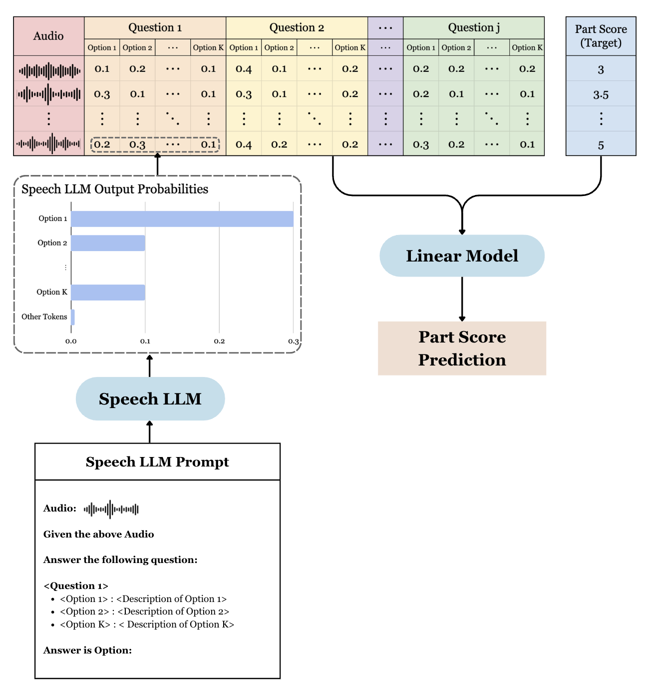

# Interpretable Automatic Spoken Language Assessment

A case study on using LLM-derived question-based interpretable features for automatic spoken language assessment.

**Full report:** [here](report/project_report%20-%20pg.pdf)

## Overview

This project develops an interpretable approach to automatic spoken language assessment using question-based features extracted from speech Large Language Models (LLMs). Rather than relying on black-box representations from self-supervised models or speech LLMs, we leverage speech LLMs to answer predefined questions about spoken responses. These answers produce a more interpretable feature set that achieves competitive performance with far fewer features.

The overall methodology is illustrated below:

## Repository Structure

- **`datasets/`** - Parquet files containing extracted interpretable question-based features for each audio file in the Speak and Improve Corpus 2025. Includes 7 files corresponding to various experiments conducted in the paper.

- **`report/`** - PDF report, LaTeX source code, and associated images.

- **`source/`** - Contains `fit_predict_score_utils.py` with functions for fitting linear models, aggregating scores, computing metrics, and calibration.

- **`notebooks/`** - Jupyter notebooks used to generate all plots and tables in the report.